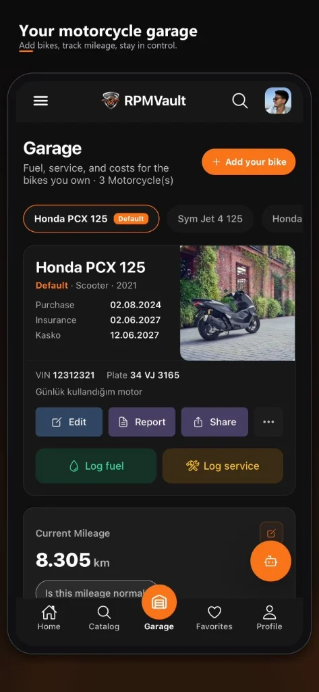
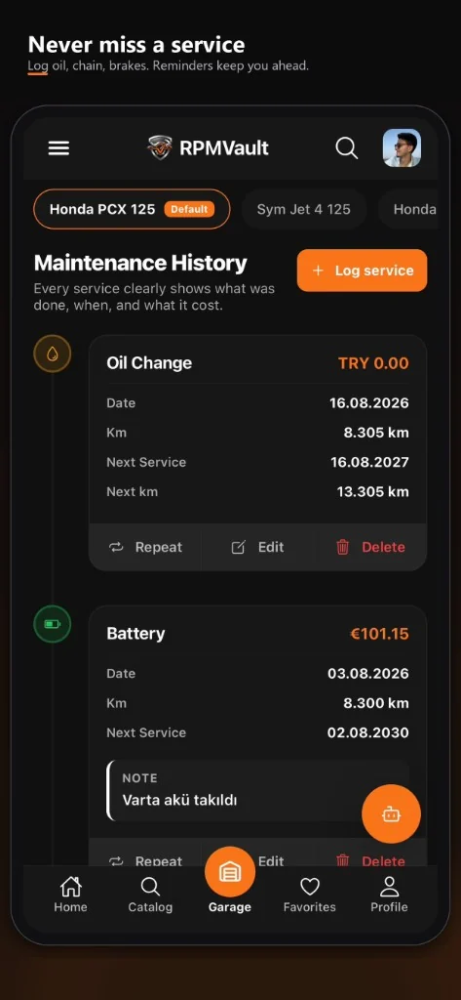
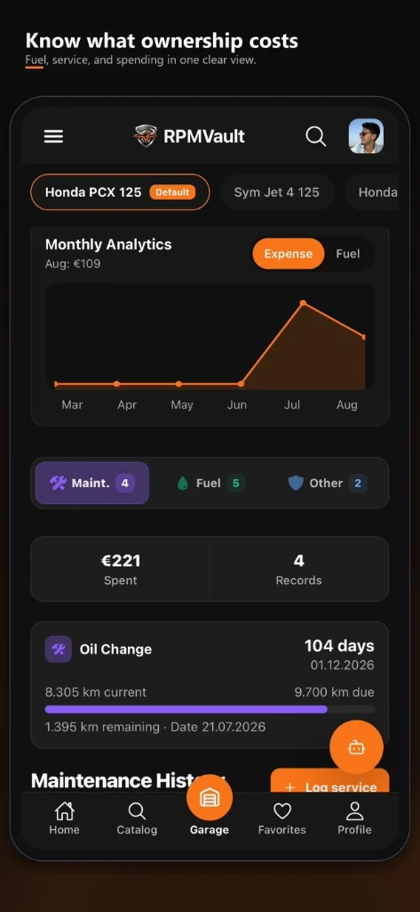
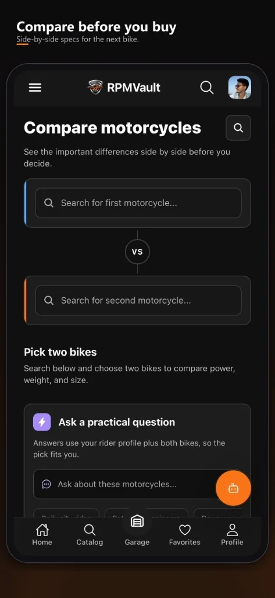
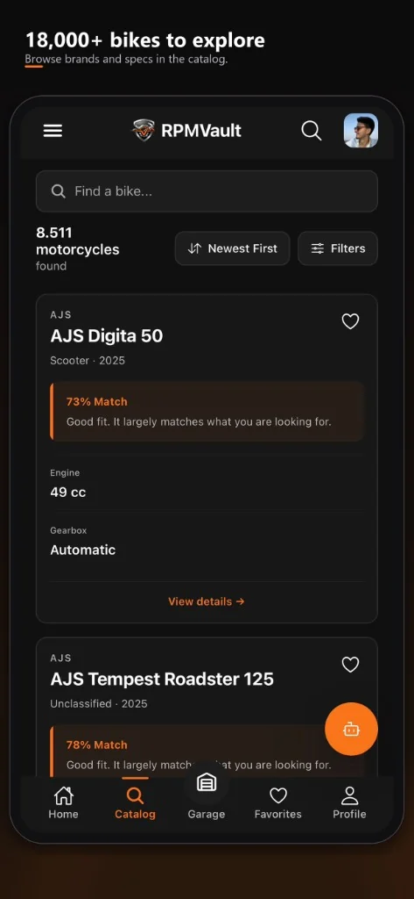
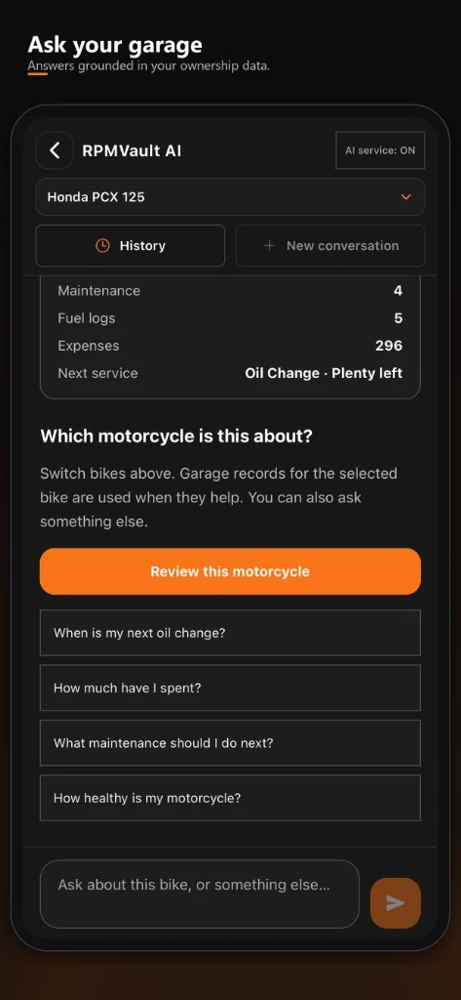

# RPMVault

> Your digital motorcycle garage. Track maintenance, fuel, mileage, and ownership costs, then explore and compare 18,000+ motorcycles on the web, iPhone, and Android.

## Get RPMVault

[](https://rpm-vault.com)
[](https://apps.apple.com/tr/app/rpmvault-motorcycle-garage/id6799125794)
[](https://play.google.com/store/apps/details?id=com.ballioz.rpmvault)

[](https://reactnative.dev)
[](https://nextjs.org)
[](https://nodejs.org)
[](https://mongodb.com)
[](https://firebase.google.com)
[](https://www.typescriptlang.org)

## Product

<p align="center">
  
  
  
</p>
<p align="center">
  
  
  
</p>

<p align="center">
  <a href="https://rpm-vault.com">Web app</a>
  &nbsp;·&nbsp;
  <a href="https://apps.apple.com/tr/app/rpmvault-motorcycle-garage/id6799125794">App Store</a>
  &nbsp;·&nbsp;
  <a href="https://play.google.com/store/apps/details?id=com.ballioz.rpmvault">Google Play</a>
</p>

## What it is

RPMVault is a motorcycle garage and maintenance tracker. Riders keep the bikes they own in one account: service history, fuel, mileage, expenses, and a catalogue for the next one.

It ships as three layers:

- **Web app.** Next.js 14 with the App Router. Garage, catalogue, and side-by-side comparison at [rpm-vault.com](https://rpm-vault.com).
- **Mobile app.** Expo SDK 54 / React Native 0.81 on [iPhone](https://apps.apple.com/tr/app/rpmvault-motorcycle-garage/id6799125794) and [Android](https://play.google.com/store/apps/details?id=com.ballioz.rpmvault). Same garage, with offline-resilient caching and in-app Premium.
- **REST API.** Node.js and Express 5, secured with Firebase Auth and deployed on Vercel. A shared TypeScript package keeps domain rules aligned across web and mobile.

## Why I built it

Motorcycle ownership usually lives in notes, photos, and memory. Service dates slip, costs stay vague, and research for the next bike happens somewhere else.

I wanted one place to log the bike I already ride and compare the next one with the same account. RPMVault started as a side project and is now a production product: web, iOS, Android, API, and the store releases around them.

## My role

RPMVault is a solo product. I own:

- Product direction and UX
- Web, mobile, and API implementation
- Data model and catalogue pipeline
- Auth, billing, and security
- App Store and Google Play releases
- Deployment, monitoring, and bilingual copy (English and Turkish)

## Core features

| Feature | Web | Mobile |
| --- | :---: | :---: |
| Digital garage for the bikes you own | ✅ | ✅ |
| Mileage, fuel logs, and expense tracking | ✅ | ✅ |
| Maintenance and service history | ✅ | ✅ |
| Maintenance calendar, including the device calendar | | ✅ |
| PDF ownership report | ✅ | ✅ |
| Catalogue of 18,000+ motorcycles, 80+ brands | ✅ | ✅ |
| Full spec sheets | ✅ | ✅ |
| Side-by-side comparison | ✅ | ✅ |
| Rider profile and match score | ✅ | ✅ |
| Favourites | ✅ | ✅ |
| RPMVault AI on garage and comparison context | ✅ | ✅ |
| Community reviews | ✅ | ✅ |
| Bilingual UI (EN / TR) | ✅ | ✅ |
| Cost display in TRY, EUR, GBP, and USD | ✅ | ✅ |
| Premium via App Store and Google Play | | ✅ |

Premium is optional. It is billed in the App Store or Google Play, and the entitlement follows the account on the web. It raises RPMVault AI and PDF export quotas. AI answers are informational and are not a substitute for a mechanic.

## Tech stack

| Layer | Technology |
| --- | --- |
| Web | Next.js 14, React Server Components, Tailwind CSS 4, shadcn/ui |
| Mobile | Expo SDK 54, React Native 0.81, React Navigation 7 |
| Language | TypeScript, shared across web, mobile, and domain logic |
| API | Node.js, Express 5 |
| Database | MongoDB Atlas |
| Auth | Firebase Authentication: email, Google, Sign in with Apple |
| Data fetching | TanStack Query v5 |
| Forms and validation | React Hook Form, Zod |
| Payments | Apple In-App Purchase and Google Play Billing, verified on the server |
| Logging | Pino |
| Mobile release | Expo EAS Build |
| Deployment | Vercel for the web app and the serverless API |
| Monorepo | pnpm workspaces: `frontend`, `mobile`, `shared` |

## Scale

- 18,000+ motorcycle records across 80+ brands
- Production web app, iOS app, and Android app
- One account on all three
- English and Turkish
- TRY, EUR, GBP, and USD

## Architecture

```
┌──────────────────────────────────────────────────────────────┐
│                         Clients                              │
│  ┌─────────────────────┐    ┌──────────────────────────────┐ │
│  │  Next.js Web App    │    │  Expo / React Native         │ │
│  │  rpm-vault.com      │    │  iOS + Android               │ │
│  └──────────┬──────────┘    └──────────────┬───────────────┘ │
│             │   HTTPS + Firebase JWT        │                │
└─────────────┼───────────────────────────────┼────────────────┘
              ▼                               ▼
┌──────────────────────────────────────────────────────────────┐
│               REST API  (Vercel Serverless)                  │
│                                                              │
│  Helmet · CORS · Rate limit · Mongo sanitize · Zod           │
│  Firebase JWT verification, then role checks                 │
│                                                              │
│  /api/bikes     /api/reviews     /api/ai                     │
│  /api/users     /api/purchase    /api/leads                  │
└────────────────────────┬─────────────────────────────────────┘
                         │
          ┌──────────────┼──────────────┐
          ▼              ▼              ▼
   MongoDB Atlas    Firebase Auth    App Store +
                                      Google Play
                                      billing
```

**Shared package.** Web and mobile consume the same TypeScript package for domain types, the API client, garage analytics, the maintenance calendar model, and ride-profile matching.

**Garage.** Mileage, fuel, service, and expenses stay on the motorcycle you own. A PDF report packages that history. On iOS and Android, upcoming maintenance can also be written to the device calendar.

**RPMVault AI.** Questions run against the selected motorcycle and the garage context that helps answer them, such as mileage, maintenance, fuel, and expense summaries.

**Security.** Helmet, a strict CORS allowlist, per-IP rate limiting, MongoDB injection sanitization, Firebase token checks, and role checks on protected routes. Collected lead phone numbers are encrypted with AES-256-GCM.

**Caching.** TanStack Query v5 uses a hierarchical key taxonomy. Mutations invalidate the affected subtree.

**SEO.** Dynamic sitemap, JSON-LD, and meta coverage in English and Turkish.

## About

RPMVault is an independent product. I design, build, ship, and maintain it: architecture, clients, API, store listings, and operations.

[](https://rpm-vault.com)
[](https://apps.apple.com/tr/app/rpmvault-motorcycle-garage/id6799125794)
[](https://play.google.com/store/apps/details?id=com.ballioz.rpmvault)

_This repository is a public engineering showcase. Source code is proprietary._
